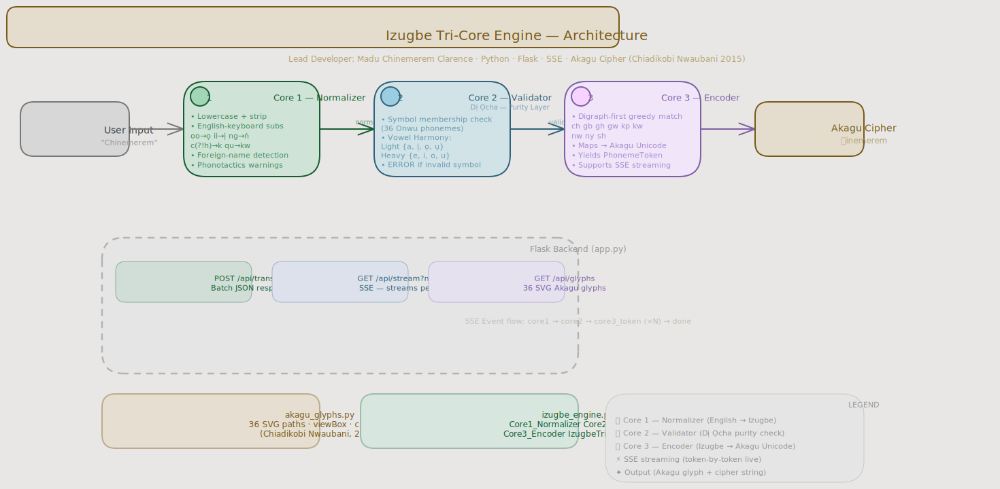

# Izugbe Tri-Core Engine — Backend

**Lead Developer:** Madu Chinemerem Clarence  
**Stack:** Python · Flask · Server-Sent Events  
**Pipeline:** English-scripted Igbo → Izugbe (Onwu) → Akagu Cipher

---

## Project Layout

```
izugbe_backend/
├── app.py             ← Flask server (run this)
├── izugbe_engine.py   ← Tri-Core pipeline (Core1, Core2, Core3)
├── akagu_glyphs.py    ← 36 Akagu SVG glyph data (from Nwaubani 2015)
├── requirements.txt
└── README.md
```

---

## Setup & Run

```bash
pip install -r requirements.txt
python app.py
# → http://localhost:5000
```

---

## API Endpoints

### `POST /api/translate` — Batch

```bash
curl -X POST http://localhost:5000/api/translate \
     -H "Content-Type: application/json" \
     -d '{"name": "Chinemerem"}'
```

Response:
```json
{
  "original":    "Chinemerem",
  "normalized":  "chinemerem",
  "valid":       true,
  "encoded":     "疾inemerem",
  "tokens":      [
    {"izugbe": "ch", "akagu": "疾", "codepoint": "U+75BE"},
    {"izugbe": "i",  "akagu": "i",  "codepoint": "U+0069"},
    ...
  ],
  "core1_diags": [...],
  "core2_diags": [...]
}
```

---

### `GET /api/stream?name=…` — SSE Stream

```bash
curl -N "http://localhost:5000/api/stream?name=Nwachukwu"
```

Events emitted in order:

| `stage`        | Payload                                      |
|----------------|----------------------------------------------|
| `core1`        | `original`, `normalized`, `diags`            |
| `core2`        | `valid`, `diags`                             |
| `core3_token`  | `token` (one per phoneme), `encoded_so_far`  |
| `done`         | `original`, `normalized`, `encoded`          |
| `aborted`      | `reason` (if Core-2 validation failed)       |

---

### `GET /api/glyphs` — Glyph Map

```bash
curl http://localhost:5000/api/glyphs
```

Returns all 36 Akagu SVG glyphs keyed by Izugbe letter.

---

## Pipeline Architecture

```
Input
  │
  ▼
Core 1 — Normalizer
  • Lowercase + strip
  • English-keyboard subs: oo→ọ, ii→ị, ng→ṅ, qu→kw, c(?!h)→k …
  • Foreign-name detection (English suffixes, consonant clusters)
  • Phonotactics warnings (3+ consonant runs, non-Igbo finals)
  │
  ▼
Core 2 — Validator (Dị Ọcha)
  • Symbol membership: all 36 Onwu phonemes
  • Vowel harmony: Light {a,ị,ọ,ụ} vs Heavy {e,i,o,u}
  │
  ▼
Core 3 — Encoder
  • Digraph-first greedy match (ch,gb,gh,gw,kp,kw,nw,ny,sh)
  • Maps every phoneme to its Akagu Unicode codepoint
  • Yields one PhonemeToken at a time (supports streaming)
  │
  ▼
Akagu Cipher String
```

---

## Architecture

Below is the system architecture for the Temperature Converter API:



> [!TIP]
> You can also view the high-resolution [PNG version](./architecture.excalidraw.png) or edit the [Excalidraw source file](./architecture.excalidraw).

---
## Translation Display

The UI renders the final cipher as:

```
Chinemerem  ←  [ch glyph][i glyph][n glyph][e glyph]…
```

Each Akagu glyph is rendered as an SVG from the original font outlines
(Chiadikobi Nwaubani, 2015), streamed live from the backend via SSE.

---

## Extending the Engine

The engine is modular. Future cores can be added:

```python
class Core4_OdinaniDictionary:
    def lookup(self, token: str) -> dict: ...

class Core5_CatholicPrayerCipher:
    def encode_prayer(self, text: str) -> str: ...
```
